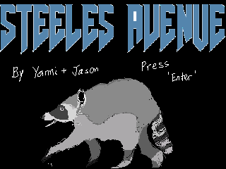

# Steeles Avenue
_Steeles Avenue_ is a Frogger-inspired game. You play as a raccoon crossing Steeles Avenue (in the Toronto-area), re-imagined as a 13-lane road. Dodge TTC and Züm buses, cars, and Ubers.

The game makes use of VGA for display and a PS/2 keyboard input. It was built for Terasic's DE1-SoC development platform, targeting a 32-bit Nios II instruction set architecture. Other development platforms or architectures are untested and may not function as intended.

Created by: Yanni Alevras and Jason Zhang

## Installation
To get started, clone the repository. Installation requirements will depend on the installation platform.

### In hardware
_Steeles Avenue_ requires the Intel FPGA Monitor Program, version 18.1. Any version that supports the DE1-SoC with Nios II (older or newer) may suffice as well.

In the Quartus Monitor Program, open the `steeles_avenue.amp` project file. Ensure that the FPGA board has the Nios II system downloaded on. From here, press `Actions > Compile & Load (F5)` to compile and program the game onto the board. If you run into a JTAG error, restart the Monitor Program.

### In simulation
On [CPUlator](https://cpulator.01xz.net/?sys=nios-de1soc), enable a DE1-SoC Nios II system. In the editor, change the language to C, and import the `src/combination.c` file. Press `Compile and Load (F5)`, then `Continue (F3)` to start the game. Display will be on the VGA pixel buffer. PS/2 input is done at device `ff200100`.

It's possible to rebuild `src/combination.c` from source. This requires a local installation of GCC and CMake version >3.10.
* In `src/main.c`, uncomment the macro definition for `#define CPULATOR`. This allows the source files to be included by the pre-processor.
* Then, with CMake, compile the `preprocess` target. The output file will be at `cmake-build-debug/preprocess_output.i`.
